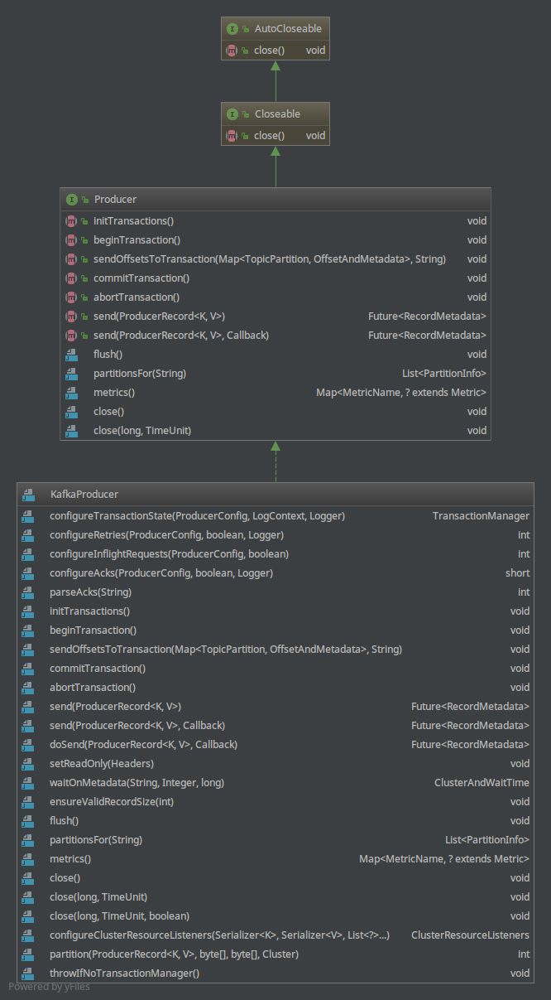

## KafkaProducer

### 类结构图

### 公有方法，对外提供API：
- **initTransactions**: 初始化事务，设置transactional id
- **beginTransaction**: 开始事务
- **sendOffsetsToTransaction**: 设置事务中消息发送位移
- **commitTransaction**: 提交事务
- **abortTransaction**: 丢弃正在进行的事务
- **send**: 消息放入RecordAccumulator暂存，等待发送
- **flush**: 将暂存在RecordAccumulator的消息发送完成
- **partitionsFor**: 在KafkaProducer中有一个存储kafka集群信息的Metadata，partitionsFor可以从Matadata中获取指定Topic的分区信息。
- **metrics**: KafkaProducer维护的统计信息
- **close**: 关闭Producer,在所有信息处理完成以后关闭发送线程

### 发送流程
- 根据配置创建KafkaProducer对象
- 构造ProducerRecord发送消息对象
- 调用KafkaProducer的send ProducerRecord方法
- 调用ProducerInterceptors拦截器拦截处理消息
- 从Metadata中获取topic信息，确保topic可用
- 将发送消息的key value进行序列化
- 计算消息要发送到的topic的分区
- 计算序列化后消息大小，防止消息过大
- (将分区添加到事务分区之中)
- 消息放入RecordAccumulator暂存
- Sender对象从RecordAccumulator暂存获取消息
- 构造ClientRequest
